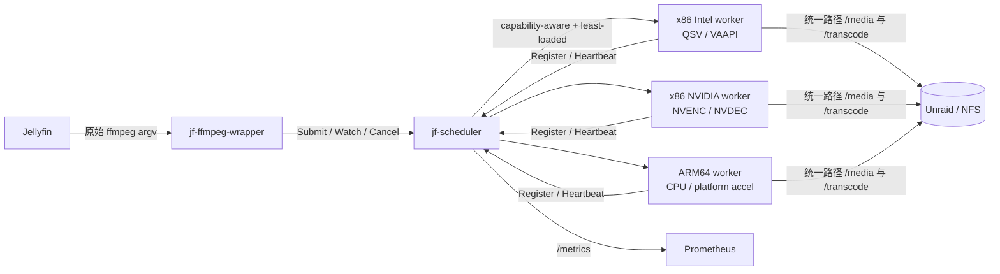
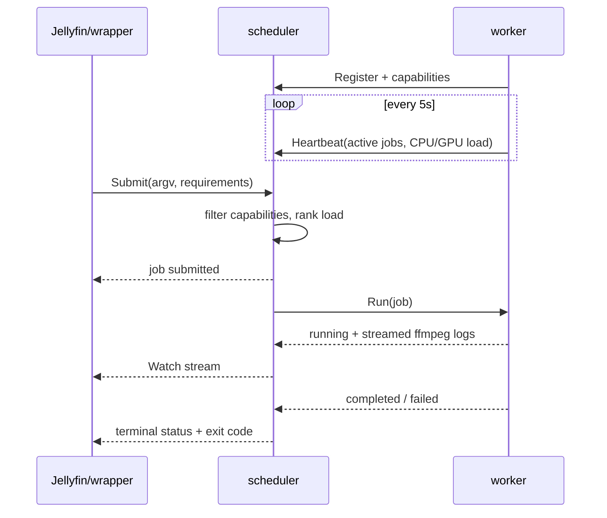

# jf-dispatch

一个面向 Jellyfin 的轻量分布式 FFmpeg 调度器。单一 Jellyfin 实例通过 `jf-ffmpeg-wrapper` 把转码任务交给 scheduler；scheduler 在 x86_64/ARM64 worker 中做能力匹配和最小负载选择；worker 在本机执行 FFmpeg。V1 不依赖 Kubernetes。

> 当前状态：可运行的 V1.1 / 技术预览。CPU 端到端路径、可配置多节点部署和基础安全层已实现；QSV、VAAPI、NVIDIA 与 ARM 已进入统一能力模型，实际命令改写仍是下一阶段工作。

## V1.1：可配置集群

V1.1 提供统一的 `jf-dispatch` 二进制、YAML 配置、环境变量覆盖、Tailscale 地址发现、节点查询、安装诊断、共享令牌和 worker 路径白名单。旧的三个二进制仍然保留，方便平滑迁移。

安装脚本还会创建 `jf-ffmpeg-wrapper`、`jf-scheduler` 和 `jf-worker` 兼容软链接。Jellyfin 可以直接把 FFmpeg 路径设置为 `/usr/local/bin/jf-ffmpeg-wrapper`；该软链接会自动使用 `JF_CONFIG` 指定的配置进入分布式 wrapper 模式。

```bash
go build -o jf-dispatch ./cmd/jf-dispatch

# 验证配置
JF_CLUSTER_TOKEN=test ./jf-dispatch config validate -config configs/cluster/scheduler.example.yaml

# home-server
JF_CLUSTER_TOKEN=test ./jf-dispatch scheduler -config configs/cluster/scheduler.example.yaml

# 对应节点分别运行
JF_CLUSTER_TOKEN=test ./jf-dispatch worker -config configs/cluster/nvidia-worker.example.yaml
JF_CLUSTER_TOKEN=test ./jf-dispatch worker -config configs/cluster/intel-worker.example.yaml
JF_CLUSTER_TOKEN=test ./jf-dispatch worker -config configs/cluster/arm-worker.example.yaml

# 查看动态注册的节点
JF_CONFIG=configs/cluster/scheduler.example.yaml JF_CLUSTER_TOKEN=test ./jf-dispatch nodes

# 安装前检查 FFmpeg、Tailscale、挂载路径和 scheduler
JF_CLUSTER_TOKEN=test ./jf-dispatch doctor -config configs/cluster/arm-worker.example.yaml
```

生产环境不要把令牌写入 YAML 或提交到 Git：

```bash
sudo install -d -m 0750 /etc/jf-dispatch
openssl rand -hex 32 | sudo tee /etc/jf-dispatch/cluster-token >/dev/null
sudo chmod 0600 /etc/jf-dispatch/cluster-token
```

将同一令牌安全复制到 scheduler 和每台 worker。`configs/systemd/jf-dispatch@.service` 可作为 systemd 模板：

共享令牌用于身份认证，不代替传输加密。V1.1 应运行在 Tailscale 或其他受信任的加密网络中；直接暴露到公网不安全。

```bash
sudo cp jf-dispatch /usr/local/bin/
sudo cp configs/systemd/jf-dispatch@.service /etc/systemd/system/
sudo cp configs/cluster/scheduler.example.yaml /etc/jf-dispatch/scheduler.yaml
sudo systemctl enable --now jf-dispatch@scheduler
```

worker 节点把自己的配置复制为 `/etc/jf-dispatch/worker.yaml`，然后运行 `sudo systemctl enable --now jf-dispatch@worker`。仓库中的 `configs/cluster/` 只包含脱敏模板；个人地址应存放在被 Git 忽略的 `configs/local/`。运行时不需要在 scheduler 中维护静态 worker 列表。

Linux 也可以用安装脚本完成用户、令牌、配置和 systemd 服务创建：

```bash
# home-server
sudo ./scripts/install-systemd.sh scheduler configs/cluster/scheduler.example.yaml

# 在对应 worker 上选择其配置
sudo ./scripts/install-systemd.sh worker configs/cluster/nvidia-worker.example.yaml
```

首次运行会生成该机器的 `/etc/jf-dispatch/cluster-token`。加入同一集群前，需要用安全方式把 home-server 的令牌复制到各 worker，覆盖它们自动生成的令牌，然后重启服务。worker 服务账户还必须拥有 NFS 路径权限；Intel/NVIDIA 节点会自动加入已有的 `video`、`render` 系统组。

配置覆盖优先级为：环境变量 > YAML > 内置默认值。常用环境变量包括 `JF_CONFIG`、`JF_CLUSTER_TOKEN`、`JF_SCHEDULER_ADDR`、`JF_WORKER_ID`、`JF_WORKER_ADVERTISE`、`JF_WORKER_MAX_JOBS`。

## 架构设计



控制面与数据面分离。媒体不经过 scheduler；worker 直接读取统一挂载路径，因此所有节点必须把同一份存储挂载到相同绝对路径。架构不同不影响调度，因为每台 worker 使用本机 FFmpeg，并上报自己的 codec 和硬件能力。

### 生命周期



调度先硬过滤 `decode codec`、`encode codec`、`hwaccel`、tone-map 能力和并发上限，再按以下成本选择最低节点：

```text
cost = active_jobs * 100 + cpu_load * 0.3 + gpu_load * 0.5
```

活跃任务权重最高，避免仅因瞬时利用率把任务继续压到同一节点。超过 15 秒没有 heartbeat 的 worker 不参与调度。

## 目录

```text
api/jfdispatch.proto              gRPC API 契约
cmd/jf-ffmpeg-wrapper/            Jellyfin 的 ffmpeg 替身
cmd/jf-scheduler/                 注册、调度、状态与日志转发
cmd/jf-worker/                    能力探测、心跳和 FFmpeg 执行
internal/api/                     V1 wire structs
internal/capability/              x86_64/ARM64、FFmpeg、DRI、NVIDIA 探测
internal/rpc/                     JSON gRPC transport 和 service bindings
internal/scheduler/               capability-aware least-loaded scheduler
internal/worker/                  进程、日志、取消和退出码管理
configs/                          环境变量样例
Dockerfile                        linux/amd64 + linux/arm64 multi-stage image
docker-compose.yml                scheduler + CPU worker + demo
```

`.proto` 是公开契约。V1 的 Go 进程用 gRPC 的 JSON codec 和手写 binding，从而不要求部署环境安装 `protoc`。未来可生成 protobuf binding，并在保留 service/method 语义的情况下切换到 protobuf wire format。

## 本地最小 demo

要求 Go 1.23+、FFmpeg。`make demo` 使用 `17000`、`17100`、`19090`，避免常见服务端口冲突；手动启动仍使用默认的 `7000`、`7100`、`9090`。

```bash
make test
make demo
ffprobe work/demo/demo.mp4
```

demo 会启动一个 scheduler 和一个本机 CPU worker，用 FFmpeg 的 `testsrc` 生成两秒 H.264 视频，并在退出时停止两个后台进程。日志位于 `work/demo/`。

也可以分三个终端启动：

```bash
go run ./cmd/jf-scheduler
go run ./cmd/jf-worker -id local-arm64 -advertise 127.0.0.1:7100
go run ./cmd/jf-ffmpeg-wrapper -f lavfi -i testsrc=size=320x240:rate=10 -t 2 -c:v libx264 -y /tmp/demo.mp4
```

健康检查：`http://localhost:9090/healthz`；Prometheus 预留端点：`http://localhost:9090/metrics`。

## Docker Compose / Unraid

先把 compose 中两个宿主路径替换为真实路径，并保证所有 worker 一致：

```yaml
/mnt/user/media:/media:ro
/mnt/user/transcode:/transcode
```

然后：

```bash
docker compose up -d scheduler worker-cpu
docker compose --profile demo run --rm demo
```

多架构镜像：

```bash
docker buildx build --platform linux/amd64,linux/arm64 -t your-registry/jf-dispatch:v1 --push .
```

Intel worker 后续可挂载 `/dev/dri`；NVIDIA worker 使用 NVIDIA Container Toolkit 暴露 GPU。`JF_WORKER_ADVERTISE` 必须是 scheduler 能访问的地址，不能在多机部署时写 `127.0.0.1`。

## Jellyfin 接入说明

在正式替换 Jellyfin 的 FFmpeg 前，先完成路径一致性与 demo 验证。wrapper 保持 FFmpeg 的同步语义：日志写到 stderr，成功返回 0，失败或取消返回非零。把 `JF_SCHEDULER_ADDR` 注入 Jellyfin 容器，并将 Jellyfin 的 FFmpeg 路径指向 `jf-ffmpeg-wrapper`。

V1 的参数推断只识别输出 `-c:v`/`-codec:v`/`-vcodec` 与 `-hwaccel`。生产接入前需要补齐 Jellyfin 实际 argv 的输入 codec、HDR tone-map、字幕烧录和多输出解析。

## 实施计划与里程碑

- V1（本仓库）：三组件、注册/心跳、能力探测、能力感知最小负载调度、完整任务生命周期、日志流、取消、CPU demo、测试、multi-arch 容器与指标端点。
- V1.2：解析 `ffprobe`/Jellyfin argv，加入任务 reservation、防重复分配、断线重试、持久化状态和结构化 Prometheus 指标；为 Intel QSV/VAAPI、NVIDIA NVENC/NVDEC 和 ARM SoC 建立命令模板与逐平台集成测试。
- V2：mTLS、worker 身份认证、路径白名单/参数安全策略、可观测性 dashboard、滚动升级和可选的 HA scheduler。

## 当前边界

- scheduler 状态在内存中，重启后任务记录丢失。
- worker 断线时不会迁移正在运行的 FFmpeg；输出必须使用安全的临时文件/原子重命名策略后才能自动重试。
- GPU load 字段已进入协议和评分模型，但 V1 heartbeat 尚未采集厂商 GPU 利用率。
- 当前没有认证；只应运行在受信任的内网。worker 会执行收到的 FFmpeg 参数，生产环境必须在 scheduler 和 worker 加入参数与路径白名单。
- 同时提交的任务尚未做原子 reservation，极短窗口内可能选择同一个 worker；V1.2 会解决。
